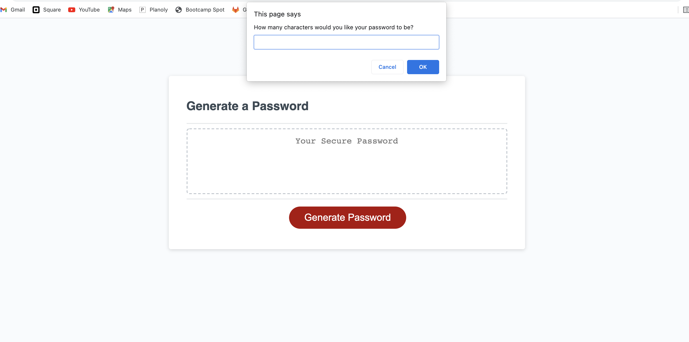

# JavaScript: Password Generator


# Task
Modify starter code to create an application that enables employees to generate random passwords based on criteria that they’ve selected. Powered by JavaScript code that I have written. 


# User Story
AS AN employee with access to sensitive data
I WANT to randomly generate a password that meets certain criteria
SO THAT I can create a strong password that provides greater security


# Description
* I have used variations for question prompt categories.

* While loops to control flow statement that allows questions to be executed repeatedly based on a given Boolean condition.

* If statements to allow control of user to input desired characters chosen in password.

* A function to generate a password once user has met all requirements & chosen desired characters.

* A function to then print the password on click of generate password button.


# Installation
1. Launch [LexMastro GitHub](https://github.com/LexMastro) & select 'password-generator' repository

2. Clone the repository 
```bash
git clone git@github.com:LexMastro/password-generator/.git
```
2. Open `index.html` in web browser to use password generator

 

## Examples



## License 
This project is licensed under the [MIT License](LICENSE)
